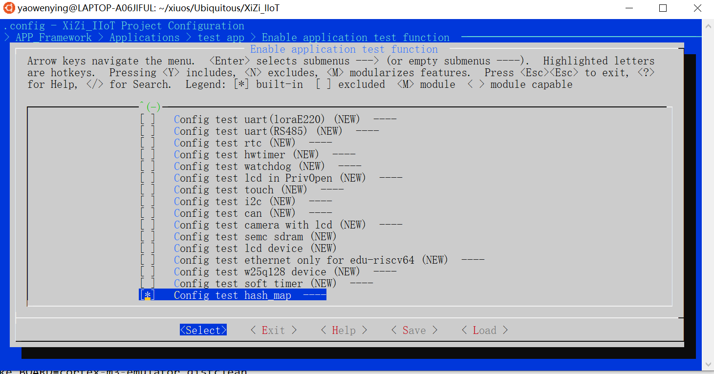
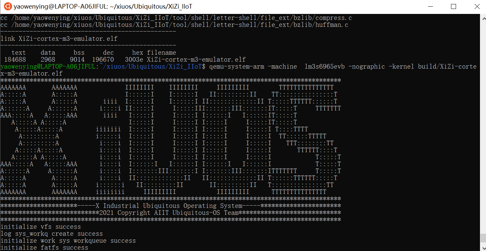
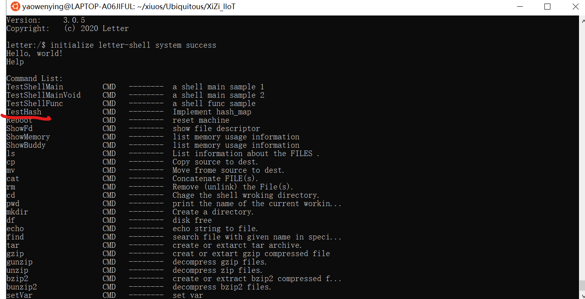
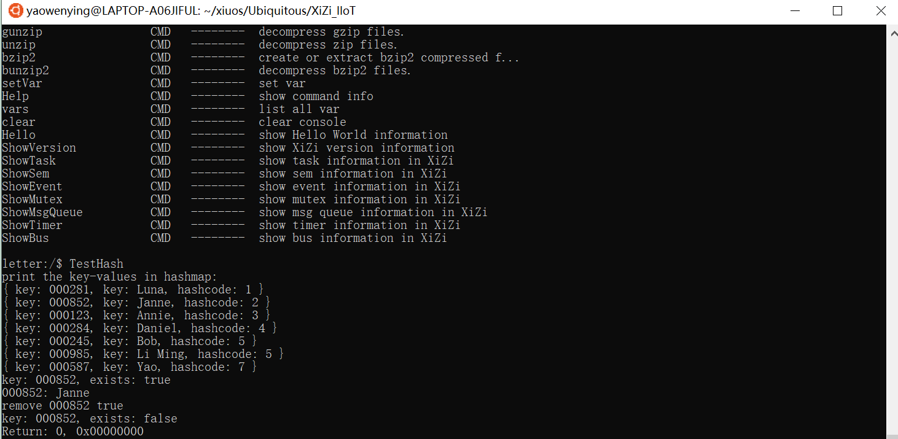

# 基于cortex-m3-emulator实现哈希表并测试验证##

## 1. 简介
利用c语言实现了哈希表（HashMap），包括添加键值对(Put)，获取键对应的值(Get), 删除健（Delete），清空哈希表(Clear)， 迭代遍历哈希表(hashMapIterator)等功能
操作。

利用数组（Entry）作为存储空间，利用链表(*next)解决冲突。当哈希表的大小超过数组大小后，为避免发生冲突过多的情况，可以对哈希表扩容。

## 2. 数据结构设计说明
键值对结构
typedef struct entry {
    void * key;             // 键
    void * value;           // 值
    struct entry * next;    // 冲突链表
}*Entry;

哈希结构
typedef struct hashMap {
    int size;           // 当前大小
    int listSize;       // 有效空间大小
    HashCode hashCode;  // 哈希函数
    Equal equal;        // 判等函数
    Entry list;         // 存储区域
    Put put;            // 添加键的函数
    Get get;            // 获取键对应值的函数
    Remove remove;      // 删除键
    Clear clear;        // 清空Map
    Exists exists;      // 判断键是否存在
    Boolean autoAssign;	// 设定是否根据当前数据量动态调整内存大小，默认开启
}*HashMap;

包括以下函数功能，分别为：
`createHashMap`：创建一个哈希结构
`defaultPut`：添加键值对
`defaultGet`：获取键对应值
`defaultRemove`：删除指定键的键值对
`defaultExists`：判断键值是否存在
`defaultClear`：清空Map的函数类型
`resetHashMap`：重新构建哈希表

## 3. 测试程序说明
测试了哈希表的插入键值对(Put)，判断键是否存在(Exist)，获取键对应的值(Get)， 删除健（Delete），迭代遍历哈希表(hashMapIterator)，清空哈希表(Clear)等操作。
并展示了利用链地址法解决哈希冲突的示例, 两个不同的人(Bob和Li Ming)的hashcode相同。

## 4. 运行结果（##需结合运行测试截图按步骤说明##）

打开menuconfig之后，将test_hash_map开启(y)，保存后退出

编译XiZi-cortex-m3-emulator.elf成功

启动qemu模拟Xiuos操作系统，验证TestHash注册Shell命令

执行TestHash命令，打印测试结果。

