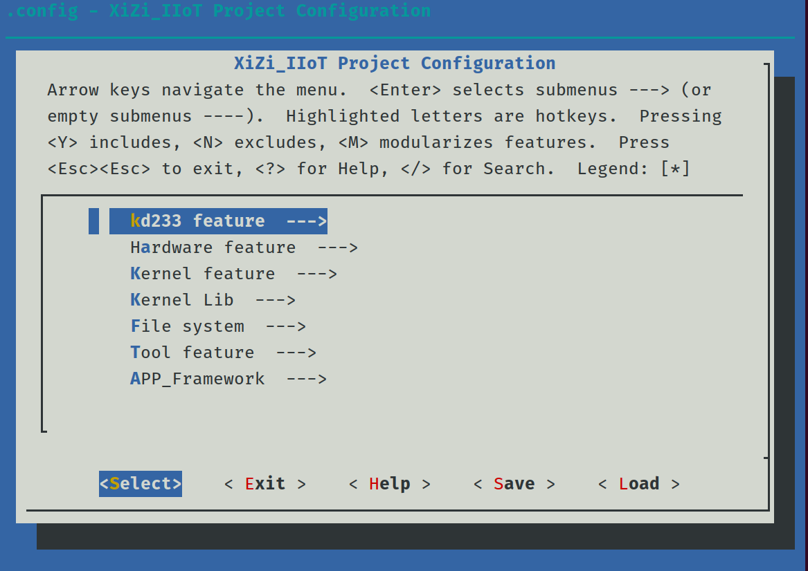
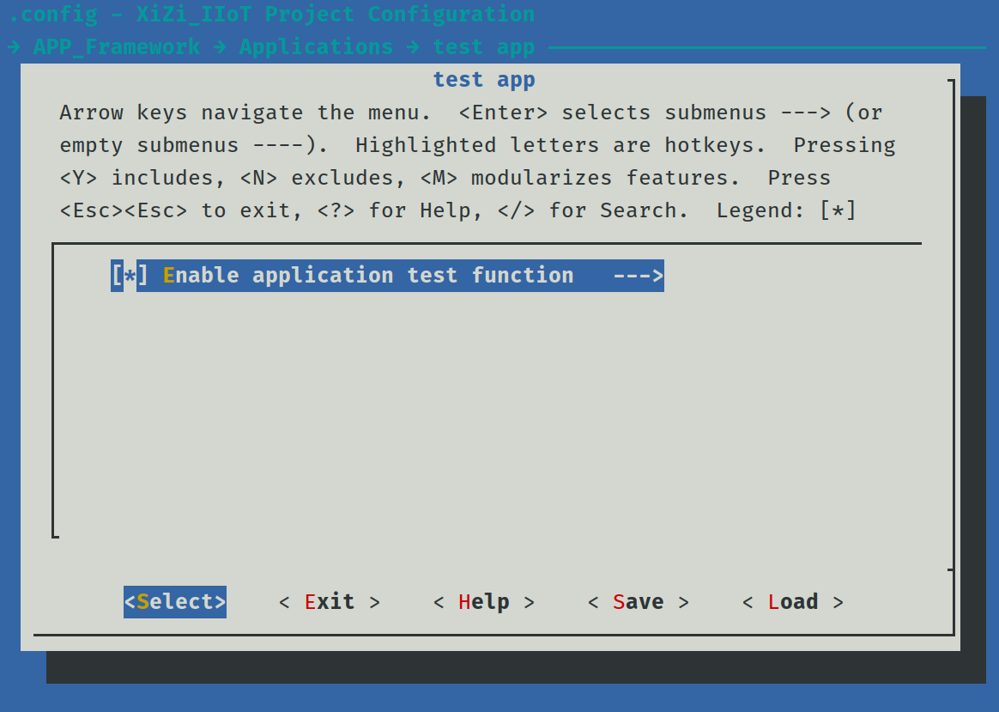
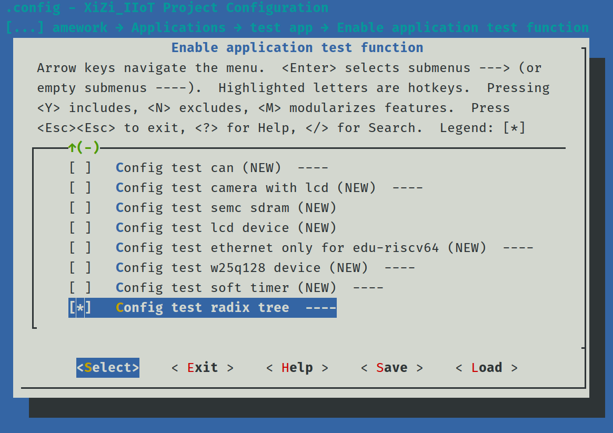
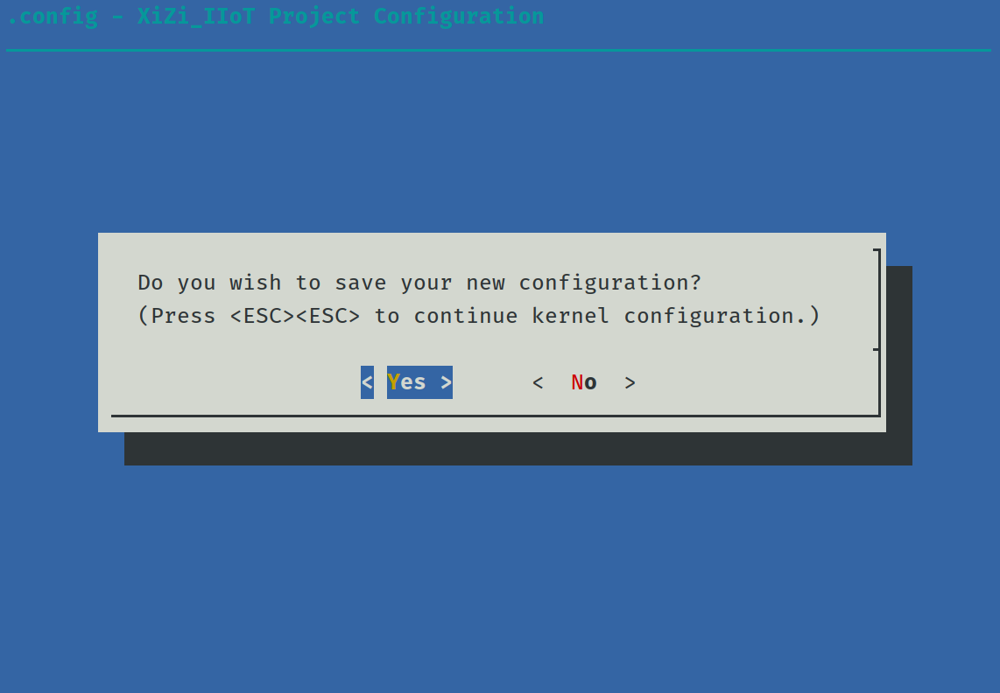
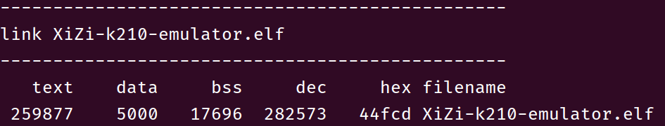
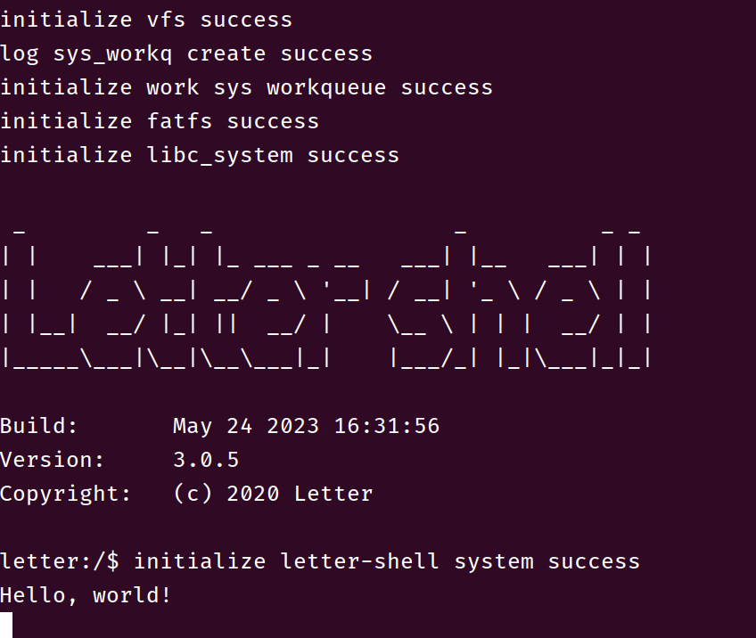
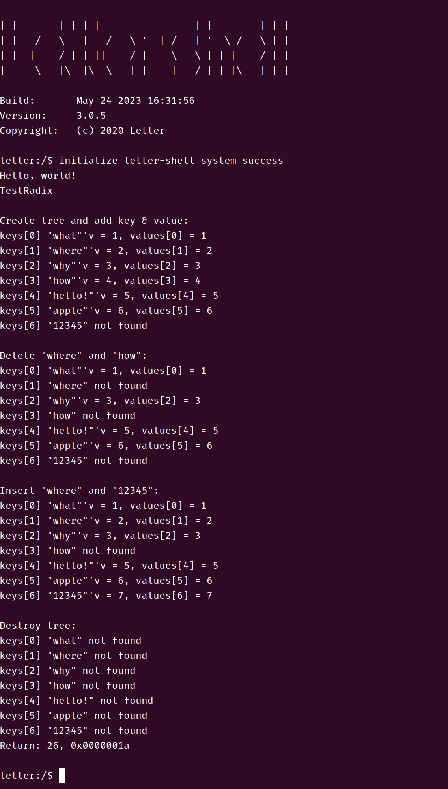

# 基于k210-emulator实现基数树并测试验证

## 1. 简介

基于矽璓模拟器k210-emulator，实现基数树，并编写测试程序在shell终端打印结果。

## 2. 数据结构设计说明

基数树节点设计为：

```c
typedef struct _node {
​    void* value;
​    struct _node* next[NODE_SIZE];
} node;
```

其中，节点在树中的路径即为键，`value` 存储值，`NODE_SIZE` 定义为 128，足以容纳所有 ASCII 值。

一共实现了 5 个函数，分别为：

- `CreateNode`：创建一个基数树节点
- `InsertNode`：将一对键值对插入基数树
- `DeleteNode`：删除指定键的键值对
- `FindNode`：查找指定键对应的值
- `DestroyTree`：销毁整个基数树

## 3. 测试程序说明

测试程序 `TestRadix` 已经注册为 shell 命令，可以调用执行。

测试程序定义了以下键值对：

```c
char keys[][MAX_WORD_LEN] = {
    "what",
    "where",
    "why",
    "how",
    "hello!",
    "apple",
    "12345"
};
int values[] = {1, 2, 3, 4, 5, 6, 7};
```

1. 程序的第一部分创建了基数树，并且将定义的 7 个键值对的前 6 个插入了基数树，然后分别查找 7 个键，前 6 个均可以找到对应的值，最后一个未插入，因此无法找到
2. 程序的第二部分从基数树中删除了 `where` 和 `how` 两个键，再次分别查找 7 个键，删除的键值对和未插入的键值对均无法找到
3. 程序的第三部分重新插入了已删除的 `where` 和未插入过的 `12345` ，再次分别查找 7 个键，新插入的值可以检索到
4. 程序的第四部分将基数树销毁，再次分别查找 7 个键，所有的键值对均无法找到

## 4. 运行结果（##需结合运行测试截图按步骤说明##）

1. 在工作区终端中输入命令：`make BOARD=k210-emulator menuconfig`，进入配置页面

2. 依次进入 `APP_Framework` -> `Applications` -> `test app` 目录，将 `Enable application test function` 选项置为 `Y`

3. 进入 `Enable application test function` 将 `Config test radix tree` 选项置为 `Y`

4. 一直选择 `Exit` 退出配置，在最后需要确认的页面选择 `Yes` 保存配置

5. 执行编译命令：`make BOARD=k210-emulator`，正常情况下应当编译无误

6. 在 `qemu` 中运行：`qemu-system-riscv64 -nographic -machine sifive_u -bios build/XiZi-k210-emulator.elf`

7. 在 shell 中运行命令 `TestRadix`，执行结果与预期一致，验证完成。
