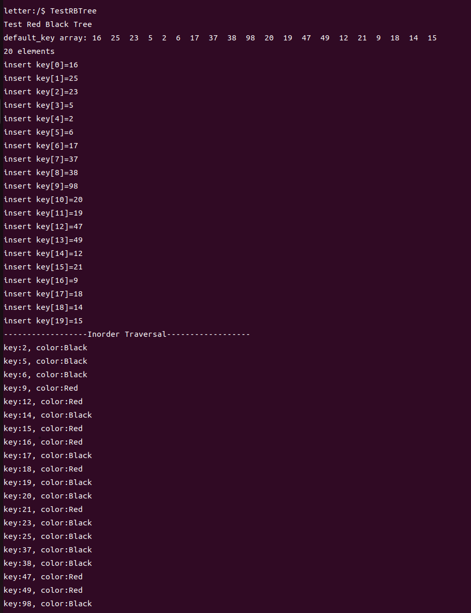
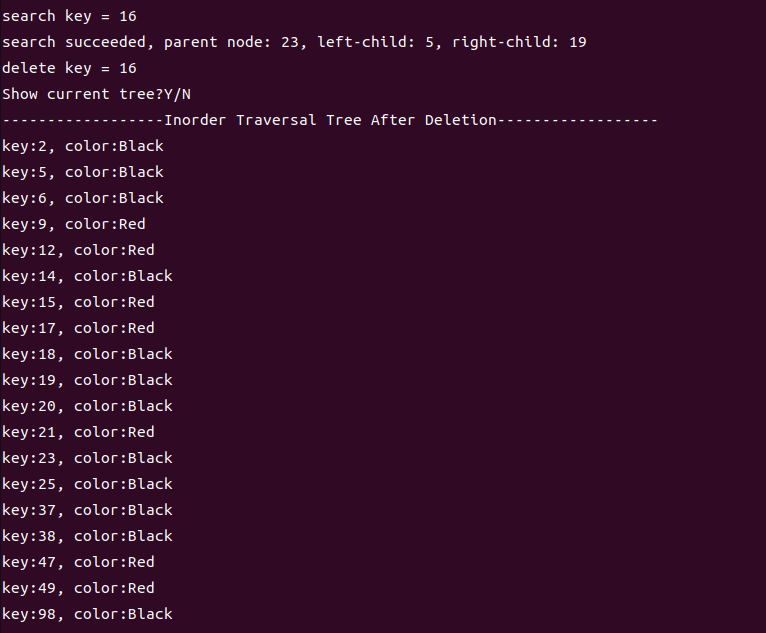
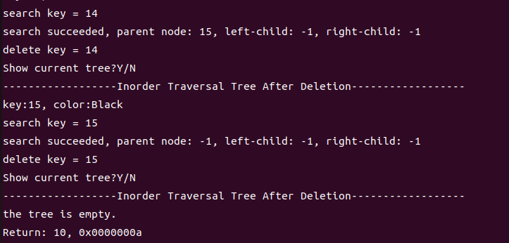

# 基于cortex-m4-emulator实现红黑树并测试验证

## 1. 简介
红黑树是一种自平衡的二叉查找树，具有良好的插入、删除和查找性能，本次提交结果为红黑树数据结构的简单实现。test_rbtree.h中定义了红黑树的数据结构和声明插入、删除、查找相关操作函数;test_rbtree.c中为操作函数的定义，并提供了测试函数TestRBTree用于验证红黑树的正确性。

## 2. 数据结构设计说明

**RBNodeType 结构体**
用来存储一个红黑树结点的相关信息
- key：节点的键值
- left_child：指向左子节点的指针
- right_child：指向右子节点的指针
- parent：指向父节点的指针
- is_red：表示节点的颜色，true表示红色，false表示黑色

**RBTreeType 结构体**
用来存储一个红黑树的相关信息
- root：指向红黑树的根节点的指针
- leaf：红黑树的叶节点，由于叶节点并不需要存储数据，故每棵树只分配一个叶节点

**RBTreeTraversal 函数**
该函数用于遍历红黑树并打印节点的键值。采用中序遍历的方式，递归地遍历左子树、当前节点和右子树。

**RBTreeLeftRotate 函数**
该函数实现红黑树的左旋转操作。接受一个当前节点指针作为参数，并按照左旋转的规则调整节点和子树的位置。

**RBTreeRightRotate 函数**
该函数实现红黑树的右旋转操作。接受一个当前节点指针作为参数，并按照右旋转的规则调整节点和子树的位置。

**InsertFixup 函数**
该函数用于插入节点后修复红黑树的平衡性。接受一个当前节点指针作为参数，并根据红黑树的性质进行旋转和着色操作，以恢复平衡。

**RBTreeInsert 函数**
该函数用于向红黑树中插入一个新节点。接受一个新节点指针作为参数，并根据新节点的键值插入到适当的位置，然后调用 InsertFixup 进行修复。

**DeleteFixup 函数**
该函数用于删除节点后修复红黑树的平衡性。接受一个当前节点指针作为参数，并根据红黑树的性质进行旋转和着色操作，以恢复平衡。

**RBTreeDelete 函数**
该函数用于从红黑树中删除指定节点。接受一个目标节点指针作为参数，并根据不同的情况进行节点的替换和删除操作，然后调用 DeleteFixup 进行修复。

**FindSuccessor 函数**
该函数用于查找给定节点的后继节点。接受一个当前节点指针作为参数，并在红黑树中找到当前节点的后继节点。

**RBTreeSearch 函数**
该函数用于在红黑树中查找指定键值的节点。接受一个键值作为参数，并在红黑树中进行查找，返回找到的节点指针。

## 3. 测试程序说明
TestRBTree用于验证红黑树的功能和正确性,下面是该程序的使用步骤和说明:
- 函数中定义一个默认关键字数组，其中包含了20个整数关键字，运行时自动遍历数组构建红黑树，构建完成后中序遍历输出结果，可以根据输出结果验证红黑树的节点顺序以及颜色是否符合预期。
- 对关键字数组中的每个关键字，在红黑树中进行搜索，并输出找到节点的父节点、左子节点和右子节点的关键字，随后删除该节点。
- 在每次删除操作后，程序会询问是否显示当前的红黑树。如果输入 "Y" 或 "y"，将再次进行中序遍历，并输出当前红黑树中的结点，可以根据输出结果查看结点是否符合预期。当树空时结束程序。

## 4. 运行结果（##需结合运行测试截图按步骤说明##）

根据默认关键字数组构建红黑树

根据键值查找结点，输出相关信息并删除，可以输入'Y'或'y'展示删除后的红黑树

到达空树，退出程序

