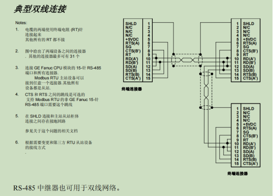

# 艾默生（原GE） 通信测试

[TOC]

## 小型VersaMAX CPU001测试

### 通信接线及参数设置

* 串口
  * COM2为15孔D型 RS485。波特率：19200，数据位：8位，停止位：1位，校验：偶校验。接线按下图典型双线接法。
  
    

### 存储区

- 存储区 I，Q，AI，R区。其他内存区如M，AQ不能直接访问，要通过程序转换访问。

### 通信测试

-  共测试BOOL，INT16，FLOAT共三种类型数据。

- 测试R区及Q区数据。

- R区数据测试，用功能码03，以字为单位读取。配方中start_address字段为PLC地址直接减1。

- Q区数据测试，用功能码01，以位为单位读取。配方中start_address字段为PLC地址直接减1。

## 中型PLC CPE100通信测试

### 通信接线及参数设置

- 网口
  - 网口RJ45，参数 IP：192.168.250.28 端口号：502

### 存储区

- 存储区 I，Q，AI，R区。其他内存区如M，AQ不能直接访问，要通过程序转换访问。

### 通信测试

-   共测试BOOL，INT16，INT32，FLOAT，DOUBLE共五种类型数据。

- 测试R区及Q区数据。

- R区数据测试，用功能码03，以字为单位读取。配方中start_address字段为PLC地址直接减1。

- Q区数据测试，用功能码01，以位为单位读取。配方中start_address字段为PLC地址直接减1。
