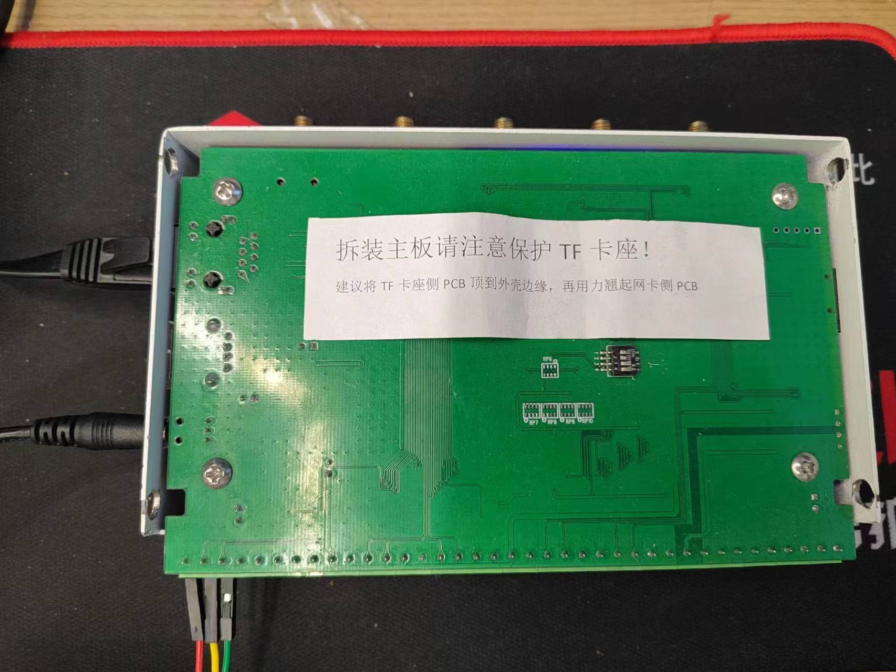

# OMRON_CP1L/H通信测试

[TOC]

## 通信接线及参数设置

* CP1L本体无接口,增加CP1W-CIF41网络板卡,CP1H自带网口,采用网线直连的方式
* FINS协议，PLC IP：192.168.250.31，Port：9600
* 
* 
* 

## 存储区

- 存储区 W，D区。

## JSON配方设计

* 共测试BOOL，INT16共2种类型数据,以下为JSON文件解释。

  - ```json
    {
        "device_id": 1,                     //设备ID默认是1，此参数无效
        "device_name": "CP1L",              //设备名称，自定义
        "communication_type": 0,            //通讯协议类型 0是以太网，1是串口 
        "socket_config": {                  //以太网配置
            "plc_ip": "192.168.250.31",     //PLC的IP地址
            "local_ip": "192.168.250.233",  //矽达通IP地址设定
            "gateway": "192.168.250.1",     //矽达通的网关地址设定
            "netmask": "255.255.255.0",     //矽达通子网掩码设定
            "port": 9600                    //端口号设定
        },
        "protocol_type": 5,                 //通讯协议，5代表FINS协议
        "read_period": 100,                 //交互周期ms
        "read_item_list": [
            {
                "value_name": "停止",  //变量名称，自定义
                "value_type": 1,      //变量类型，BOOL = 1,INT8 = 2,INT16,INT32,UINT8,UINT16,UINT32,DOUBLE,FLOAT = 9
                "area_char": "W",     //变量功能块
                "data_type": 0,       //数据传输类型，BOOL = 0,WORD = 1
            	"start_address": 100, //起始地址
                "bit_address": 1,     //BOOL地址偏移位，采集变量地址是W100.1
                "data_length": 1      //BOOL长度，默认是1，代表读取1个BOOL长度
            },
            {
                "value_name": "转速",  //变量名称，自定义
                "value_type": 3,      //变量类型，BOOL = 1,INT8 = 2,INT16,INT32,UINT8,UINT16,UINT32,DOUBLE,FLOAT = 9
                "area_char": "D",     //变量功能块
                "data_type": 1,       //数据传输类型，BOOL = 0,WORD = 1
                "start_address": 101, //起始地址
                "bit_address": 0,     //以WORD采集方式时此参数无效，采集变量地址是D101
                "data_length": 1      //WORD长度，默认是1，代表读取1个WORD长度，2个字节
            }
        ]
    }
    ```

## 通信测试

 (1) 新增1个通信demo，命名为omron_cp1l.c；

 (2) 复制样例代码程序到omron_cp1l.c文件中；

 (3) void **ControlOmronCP1LTest**(void) 更改函数名；

 (4) PRIV_SHELL_CMD_FUNCTION(**ControlOmronCP1LTest**, **Omron Plc Cp1l Demo**, PRIV_SHELL_CMD_MAIN_ATTR);更改测试指令；

  (5) 剪裁配置完成后，用过烧写器下载至矽达通中，重启后完成测试。


 