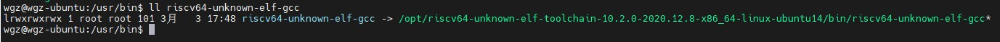
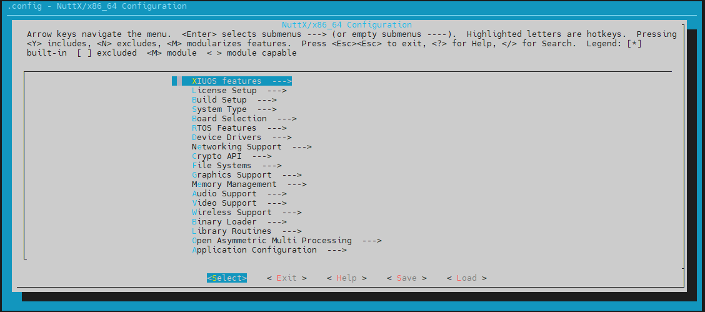
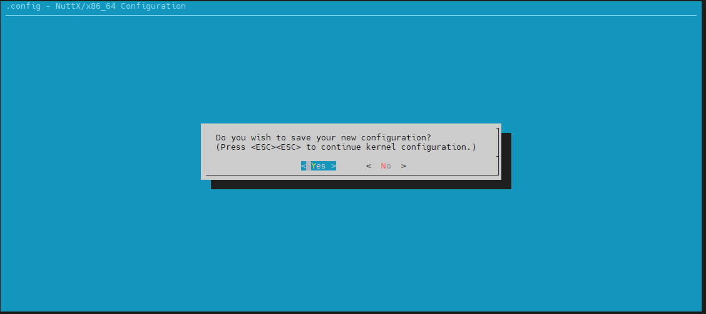
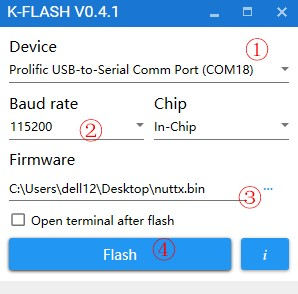
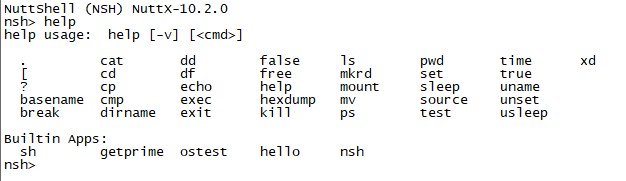

# 从零开始构建矽璓工业物联操作系统：使用ARM架构的矽达通

# xidatong-riscv64

[XiUOS](http://xuos.io/) (X Industrial Ubiquitous Operating System) 矽璓XiUOS是一款面向智慧车间的工业物联网操作系统，主要由一个极简的微型实时操作系统内核和其上的工业物联框架构成，通过高效管理工业物联网设备、支撑工业物联应用，在生产车间内实现智能化的“感知环境、联网传输、知悉识别、控制调整”，促进以工业设备和工业控制系统为核心的人、机、物深度互联，帮助提升生产线的数字化和智能化水平。

## 1. 简介

| 硬件 | 描述 |
| -- | -- |
|芯片型号| 勘智K210 |
|架构| 双核riscv64 |
|主频| 400MHz                                                       |
|片内SRAM| 8M |
|外设支持| 内嵌AES与SHA256算法加速器 |
|| DVP、JTAG、OTP、FPIOA、GPIO、UART、SPI、RTC、I²S、I²C、WDT、Timer与PWM |

XiUOS板级当前支持使用CH438、GPIO、UART等。

## 2. 开发环境搭建

### 推荐使用：

**操作系统：** ubuntu18.04 [https://ubuntu.com/download/desktop](https://ubuntu.com/download/desktop)

更新`ubuntu 18.04`源的方法:（根据自身情况而定，可以不更改）

第一步:打开sources.list文件

```c
sudo vim /etc/apt/sources.list
```

第二步:将以下内容复制到sources.list文件

```c
deb http://mirrors.aliyun.com/ubuntu/ bionic main restricted universe multiverse
deb http://mirrors.aliyun.com/ubuntu/ bionic-security main restricted universe multiverse
deb http://mirrors.aliyun.com/ubuntu/ bionic-updates main restricted universe multiverse
deb http://mirrors.aliyun.com/ubuntu/ bionic-proposed main restricted universe multiverse
deb http://mirrors.aliyun.com/ubuntu/ bionic-backports main restricted universe multiverse
deb-src http://mirrors.aliyun.com/ubuntu/ bionic main restricted universe multiverse
deb-src http://mirrors.aliyun.com/ubuntu/ bionic-security main restricted universe multiverse
deb-src http://mirrors.aliyun.com/ubuntu/ bionic-updates main restricted universe multiverse
deb-src http://mirrors.aliyun.com/ubuntu/ bionic-proposed main restricted universe multiverse
deb-src http://mirrors.aliyun.com/ubuntu/ bionic-backports main restricted universe multiverse
```

第三步:更新源和系统软件

```c
sudo apt-get update
sudo apt-get upgrade
```

**开发工具推荐使用 VSCode   ，VScode下载地址为：** VSCode  [https://code.visualstudio.com/](https://code.visualstudio.com/)，推荐下载地址为 [http://vscode.cdn.azure.cn/stable/3c4e3df9e89829dce27b7b5c24508306b151f30d/code_1.55.2-1618307277_amd64.deb](http://vscode.cdn.azure.cn/stable/3c4e3df9e89829dce27b7b5c24508306b151f30d/code_1.55.2-1618307277_amd64.deb)

### 依赖包安装：

```
$ sudo apt install build-essential pkg-config  git
$ sudo apt install gcc make libncurses5-dev openssl libssl-dev bison flex libelf-dev autoconf libtool gperf libc6-dev
```

**XiUOS操作系统源码下载，这个仓里的代码可能不是最新的，最好git clone自己仓里的代码：** XiUOS [https://www.gitlink.org.cn/xuos/xiuos](https://www.gitlink.org.cn/xuos/xiuos)

新建一个空文件夹并进入文件夹中，并下载源码，具体命令如下：

```c
mkdir test  &&  cd test
git clone https://gitlink.org.cn/xuos/xiuos.git
git checkout origin/prepare_for_master  (以实际分支为准)
```

打开XiUOS源码文件包可以看到以下目录：
| 名称 | 说明 |
| -- | -- |
| APP_Framework | 应用代码 |
| Ubiquitous | 板级支持包,支持NuttX、RT-Thread和XiZi内核 |


### 裁减配置工具的下载

裁减配置工具：

**工具地址：** kconfig-frontends [https://www.gitlink.org.cn/xuos/kconfig-frontends](https://www.gitlink.org.cn/xuos/kconfig-frontends)，下载与安装的具体命令如下：

```c
mkdir kfrontends  && cd kfrontends
git clone https://gitlink.org.cn/xuos/kconfig-frontends.git
```

下载源码后按以下步骤执行软件安装：

```c
cd kconfig-frontends
./xs_build.sh
```

### 编译工具链：

Riscv64： riscv64-unknown-elf-toolchain-10.2.0-2020.12.8-x86_64-linux-ubuntu14.tar，在我的个人仓保存有一份：

https://gitlink.org.cn/wgzAIIT/build_tools.git

下载后解压到Ubantu环境的/opt目录下。

再将/opt/riscv64-unknown-elf-toolchain-10.2.0-2020.12.8-x86_64-linux-ubuntu14/bin目录下的全部二进制文件软连接到/usr/bin，例如




## 3.编译bin包

1.XiUOS操作系统源码下载： [https://www.gitlink.org.cn/xuos/xiuos](https://www.gitlink.org.cn/xuos/xiuos)

   目前大家都使用的个人仓，请注意此处的路径及分支，如果需要须进行分支切换

2.在Ubuntu18.04环境中的代码路径，执行以下命令，生成配置文件

```shell
cd ./Ubiquitous/Nuttx_Fusion_XiUOS/app_match_nuttx
source build.sh

执行完毕会自动进入./Ubiquitous/Nuttx_Fusion_XiUOS/nuttx下，继续执行

./tools/configure.sh xidatong-riscv64:nsh
make menuconfig
视情况而定，如果需要前面加sudo
```

3..在menuconfig界面配置需要关闭和开启的功能，按回车键进入下级菜单，按Y键选中需要开启的功能，按N键选中需要关闭的功能，配置结束后保存并退出（本例旨在演示简单的输出例程，所以没有需要配置的选项，双击快捷键ESC退出配置）



退出时选择`yes`保存上面所配置的内容，如下图所示：



4.继续执行以下命令，进行编译

```shell
make
或
make -j8
```

make时加上V=1参数可以看到较为详细的编译信息，但是编译过程会比较慢。

5.如果编译正确无误，会在当前目录下产生nuttx.bin、nuttx、nuttx.hex等文件。

## 4. 烧写及运行

### 4.1 烧写
1、烧写工具：K-Flash.exe，可https://gitlink.org.cn/wgzAIIT/build_tools.git下载



在①选择串口 com 号

在②处选择波特率，选择 115200

在③处选择编译出的 nuttx.bin 文件

设备在上电时确保 Boot 和 GND 短接，这是升级模式。

点击④处 Flash 开始烧录，显示烧录完成即可，中间有报错的话，重新 Flash。

### 4.2 运行结果

烧写完毕重新上电，进入 shell。


