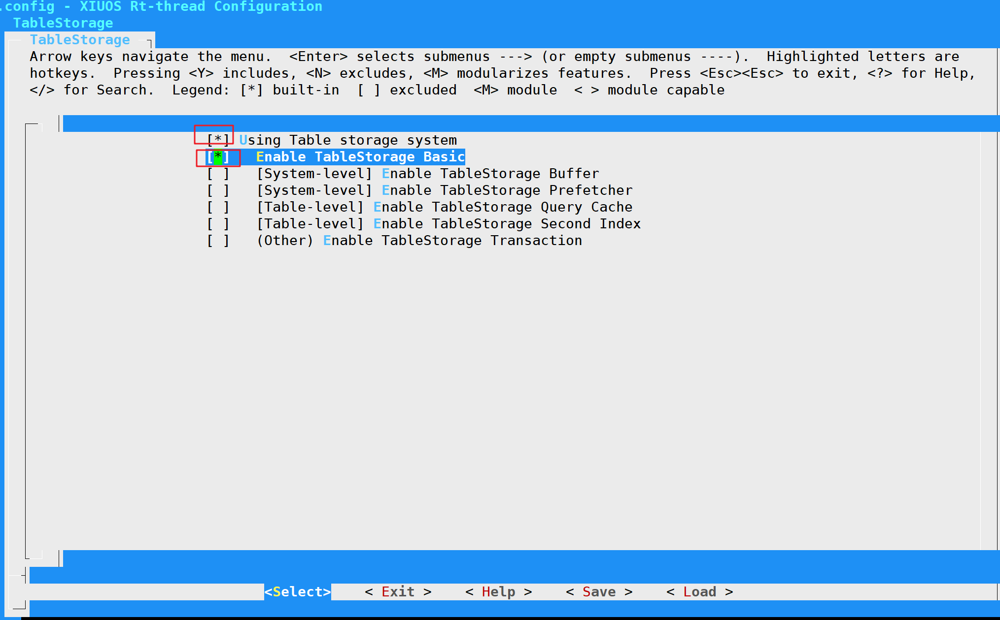

## README

TableStorage是一款面向泛在操作系统的轻量级表存储原型系统。TableStorage专注于泛在操作系统场景下结构化数据的存储，与传统的多层堆叠式软件栈（数据库 + 文件系统）不同，TableStorage避免过度分层，从存储全栈角度，进行跨层（数据库的存储引擎 + 文件系统）的设计，主要包含以下三个属性

- 低冗余：去除文件抽象并直接将“表”存储到设备中, 避免功能冗余和不必要的软件开销
- 兼容性：提供一组通用的API 以支持表级的存取操作，与传统数据库中的读写操作兼容
- 可集成：支持组件的深度集成，具体来说, 可以集成事务和执行引擎以满足复杂的事务和查询处理需求


### 开发板

- K210最小系统板（Max bit）

- SD卡配置

  |        引脚        |   作用    | RW007板子 |
  | :----------------: | :-------: | :-------: |
  | io 27(印丝标注SCK) | SPI1_SCK  |    SCK    |
  | io 26(印丝标注SO)  | SPI1_MISO |   MISO    |
  | io 28(印丝标注SI)  | SPI1_MOSI |   MOSI    |
  |       io 29        | CS/BOOT1  |    CS     |


### 编译说明

- 环境搭建

  - 参考https://gitlink.org.cn/xuos/xiuos/tree/prepare_for_master/Ubiquitous%2FXiZi_IIoT%2Fboard%2Fkd233下的**开发环境搭建**小节，搭建好XiUOS的开发环境

  - 参考https://gitlink.org.cn/xuos/xiuos/tree/prepare_for_master/Ubiquitous%2FRT-Thread_Fusion_XiUOS%2Faiit_board%2Fk210搭建好XiUOS-RTThread的开发环境

- 配置XiUOS-RTThread基本环境

  - SD卡的配置：按照上表SD卡引脚说明配置

    

  - 其他推荐配置

    

  - （可选）如果编译时，出现定时器错误，则可以选择使用软件定时器

    

- 配置TableStorage

  ```shell
  scons --menuconfig
  ```

  - 若不开启TableStorage组件，则自动在SD卡上使用FATFS

  - 若开启TableStorage组件，则在SD卡上使用TableStorage，默认打开了Enable TableStorage Basic模块（注：当前版本仅支持Basic模块）

  

- 执行 scons 编译，若编译正确无误，在当前文件夹下生成rtthread.elf、rtthread.bin。其中rtthread.bin需要烧写到设备中进行运行

- 烧录及运行结果图

  ```shell
  sudo kflash -t rtthread.bin -p /dev/ttyUSB0
  ```

  - 烧录并运行无误，则

  


### 调试

- 修改k210/rtconfig.py中的BUILD选项来配置debug模式，并重新编译

- 安装openocd（下载ubuntu版本64位），

  - 下载地址：[Releases · kendryte/openocd-kendryte (github.com)](https://github.com/kendryte/openocd-kendryte/releases),推荐下载地址为：http://101.36.126.201:8011/kendryte-openocd-0.2.3-ubuntu64.tar.gz

  - 安装

    ```shell
    sudo apt install libusb-dev libftdi-dev libhidapi-dev
    sudo mv kendryte-openocd-0.2.3-ubuntu64.tar.gz /opt
    cd /opt
    sudo tar -zxvf kendryte-openocd-0.2.3-ubuntu64.tar.gz
    ```

  - 修改配置文件

    sudo vim /opt/kendryte-openocd/tcl/k210.cfg，并复制以下内容

    ```shell
    # SiPEED USB-JTAG/TTL
    interface ftdi
    ftdi_device_desc "Dual RS232" 
    ftdi_vid_pid 0x0403 0x6010
    ftdi_layout_init 0x0508 0x0f1b
    ftdi_layout_signal nTRST -data 0x0200 -noe 0x0100 
    ftdi_layout_signal nSRST -data 0x0800 -noe 0x0400 
    
    jtag_rclk 3000
    
    # server port 
    gdb_port 9999
    telnet_port 4444 
    
    # add cpu target
    set _CHIPNAME riscv
    jtag newtap $_CHIPNAME cpu -irlen 5 -expected-id 0x04e4796b 
    
    set _TARGETNAME $_CHIPNAME.cpu
    target create $_TARGETNAME riscv -chain-position $_TARGETNAME 
    
    # command
    init
    if {[ info exists pulse_srst]} { 
        ftdi_set_signal nSRST 0
        ftdi_set_signal nSRST 1 
        ftdi_set_signal nSRST z
    }
    halt
    ```

- 调试器和Max bit开发板的硬件连线

  

- 启动调试器

  ```shell
  sudo /opt/kendryte-openocd/bin/openocd -f /opt/kendryte-openocd/tcl/k210.cfg
  ```

  

- 在Ubiquitous/RT-Thread_Fusion_XiUOS/aiit_board/k210目录下，连接调试器

  ```shell
  /opt/xpack-riscv-none-embed-gcc-10.2.0-1.2/bin/riscv-none-embed-gdb rtthread.elf --eval-command="target remote 127.0.0.1:9999"
  ```

  - gdb终端调试

  


- vscode调试

  
