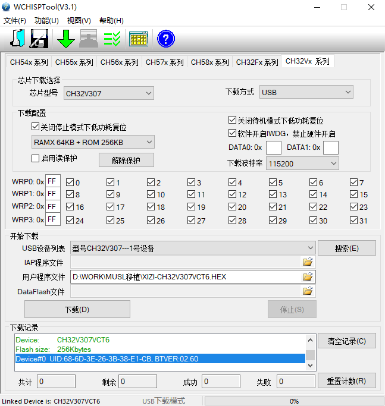
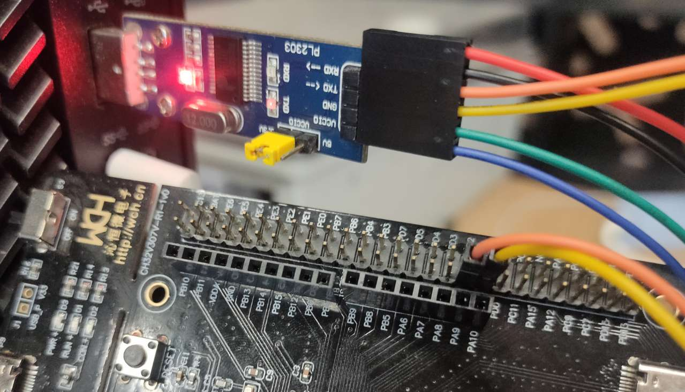
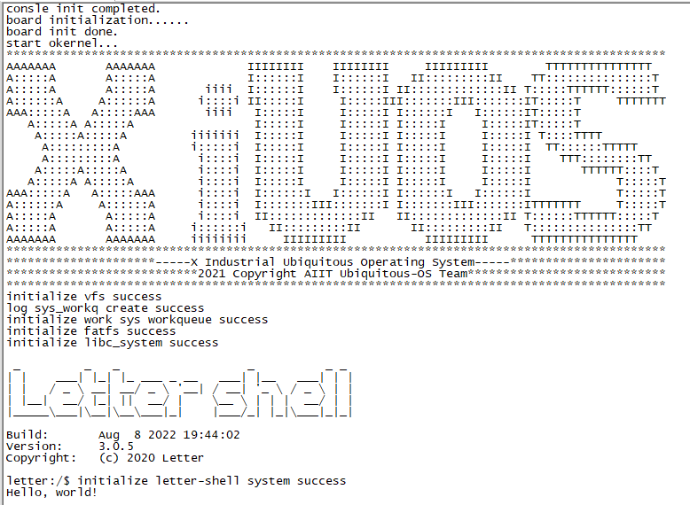

# CH32V307VCT6-board README

## 1. 简介

| 硬件 | 描述 |
| -- | -- |
|芯片型号| ch32v307 |
|CPU| 单核RV32GC |
|主频| 144MHz |
|片内SRAM| 可配最大128KB |
| 外设 |  |
| | GPIO、UART|

## 2. 编译说明

编译环境：Ubuntu18.04

编译工具链：riscv-none-embed-gcc ( xPack GNU RISC-V Embedded GCC)  
**xPack RISC-V Embedded GCC** 工具链可以使用[xpm](https://www.npmjs.com/package/xpm)工具进行安装:

```console
$ xpm install --global @xpack-dev-tools/riscv-none-embed-gcc@8.2.0-3.1.1
```

编译步骤：

>1.将编译工具链的路径添加到board/ch32v307vct6/config.mk文件当中，例如将xpack-riscv-none-elf-gcc解压到/opt/下时添加：
```
export CROSS_COMPILE ?=/opt/riscv-embedded-gcc/bin/riscv-none-embed-
```
>2.在代码根目录下执行以下命令，生成配置文件
```
cd ./Ubiquitous/XiZi
make BOARD=ch32v307vct6 distclean
make BOARD=ch32v307vct6 menuconfig
```
>3.在menuconfig界面配置需要关闭和开启的功能，按回车键进入下级菜单，按Y键选中需要开启的功能，按N键选中需要关闭的功能，配置结束后选择Exit保存并退出
>4.继续执行以下命令，进行编译
```
make BOARD=ch32v307vct6
```
>5.如果编译正确无误，会产生XiZi-ch32v307vct6.elf、XiZi-ch32v307vct6.bin文件。其中XiZi-ch32v307vct6.bin需要烧写到设备中进行运行。
>注：最后可以执行以下命令，清除配置文件和编译生成的文件
```
make BOARD=ch32v307vct6 distclean
```

## 3. 烧写及执行

开发板可使用数据线通过USB接口与电脑连接，将开发板的Boot0接口通电（连接VCC）后按动ReSet按钮，即可使用烧录工具[WCHISPTool](https://www.wch.cn/download/WCHISPTool_Setup_exe.html)进行烧录。烧录工具的配置如下图所示。

烧录完成后可通过串口连接PC电脑与开发版，TX(PA9)接串口RX、RX(PA10)接串口TX。

### 3.1 运行结果

如果编译 & 烧写无误，将开发板BOOT引脚与VCC引脚断开后重新上电或将RESET引脚短接一下，将会在串口终端上看到信息打印输出。

