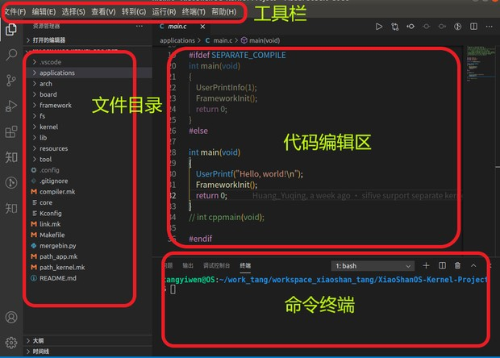
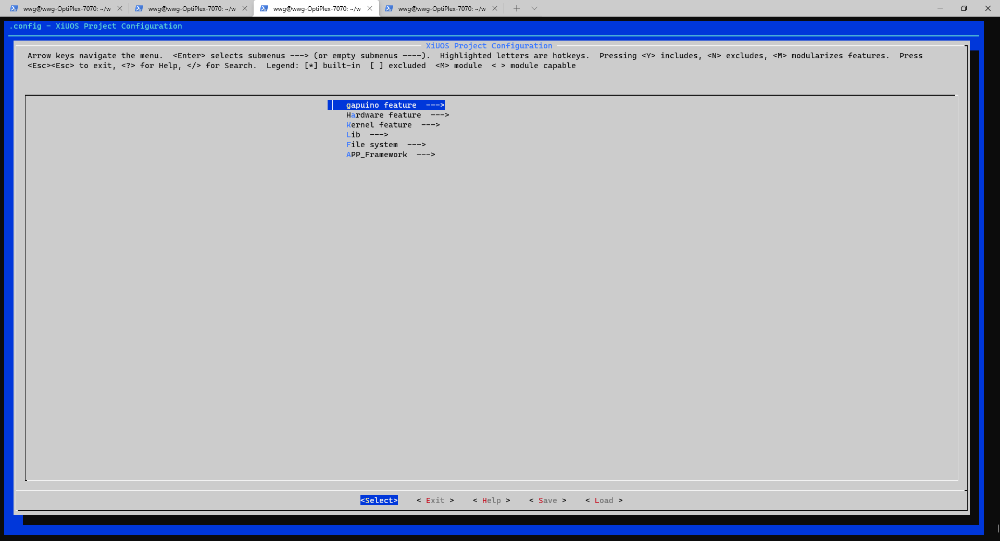
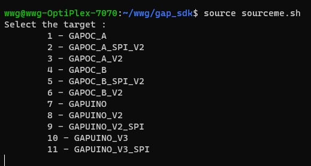
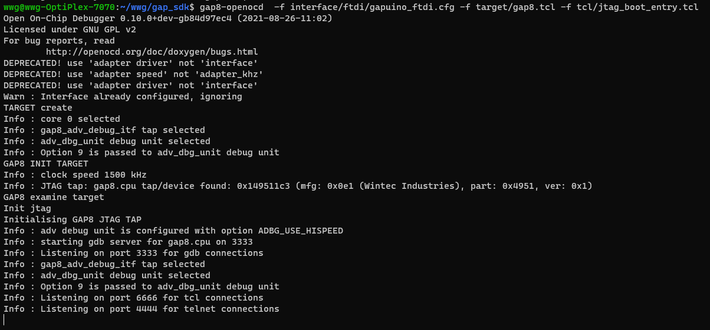
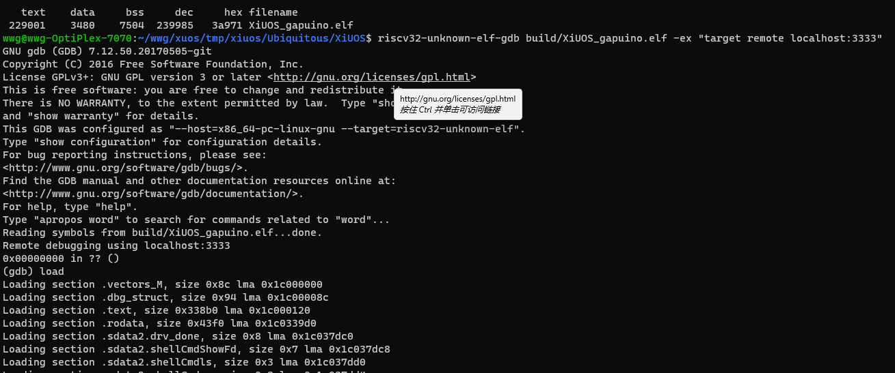
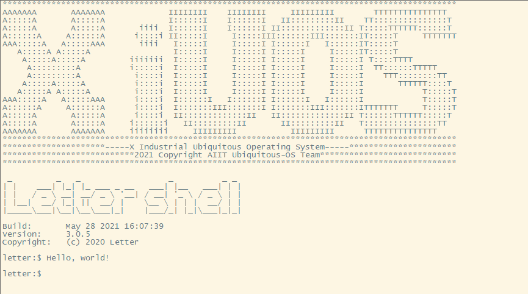

# 从零开始构建矽璓工业物联操作系统：使用risc-v架构的gapuino 开发板

[XiUOS](http://xuos.io/) (X Industrial Ubiquitous Operating System) 矽璓工业物联操作系统是一款面向工业物联场景的泛在操作系统，来自泛在操作系统研究计划。所谓泛在操作系统(UOS: Ubiquitous Operating Systems)，是支持互联网时代人机物融合泛在计算应用模式的新型操作系统，是传统操作系统概念的泛化与延伸。在泛在操作系统技术体系中，不同的泛在计算设备和泛在应用场景需要符合各自特性的不同UOS，XiUOS即是面向工业物联场景的一种UOS，主要由一个极简的微型实时操作系统(RTOS)内核和其上的智能工业物联框架构成，支持工业物联网(IIoT: Industrial Internet of Things)应用。


## 开发环境搭建

### 推荐使用：

**操作系统：** ubuntu18.04 [https://ubuntu.com/download/desktop](https://ubuntu.com/download/desktop)

**开发工具推荐使用 VSCode   ，VScode下载地址为：** VSCode  [https://code.visualstudio.com/](https://code.visualstudio.com/)，推荐下载地址为 [http://vscode.cdn.azure.cn/stable/3c4e3df9e89829dce27b7b5c24508306b151f30d/code_1.55.2-1618307277_amd64.deb](http://vscode.cdn.azure.cn/stable/3c4e3df9e89829dce27b7b5c24508306b151f30d/code_1.55.2-1618307277_amd64.deb)

### 依赖包安装：

```
$ sudo apt install build-essential pkg-config
$ sudo apt install gcc make libncurses5-dev openssl libssl-dev bison flex libelf-dev autoconf libtool gperf libc6-dev  git
```

**源码下载：** XiUOS [https://www.gitlink.org.cn/xuos/xiuos](https://www.gitlink.org.cn/xuos/xiuos)

新建一个空文件夹并进入文件夹中，并下载源码，具体命令如下：

```c
mkdir test  &&  cd test
git clone https://gitlink.org.cn/xuos/xiuos.git
```

1、打开XiUOS源码文件包可以看到以下目录：
| 名称 | 说明 |
| -- | -- |
| APP_Framework | 应用代码 |
| Ubiquitous | 板级支持包,支持NuttX、RT-Thread和XiZi内核 |

2、打开XiZi内核源码文件包可以看到以下目录：
| 名称 | 说明 |
| -- | -- |
| arch | 架构代码 |
| board | 板级支持包 |
| fs | 文件系统 |
| kernel | 内核源码 |
| lib | 第三方库源码 |
| resources | 驱动文件 |
| tool | 系统工具 |

使用VScode打开代码，具体操作步骤为：在源码文件夹下打开系统终端，输入`code .`即可打开VScode开发环境，如下图所示：


  
### 裁减配置工具的下载

裁减配置工具：

**工具地址：** kconfig-frontends [https://www.gitlink.org.cn/xuos/kconfig-frontends](https://www.gitlink.org.cn/xuos/kconfig-frontends)

```c
mkdir kfrontends  && cd kfrontends
git clone https://gitlink.org.cn/xuos/kconfig-frontends.git
```

下载源码后按以下步骤执行软件安装：

```c
cd kconfig-frontends
./xs_build.sh
```

### 编译工具链：

RISC-V: riscv-none-embed-，默认安装到Ubuntu的/opt/，下载源码并解压。[下载链接：https://pan.baidu.com/s/1mWlR86FMc-xPQwDXJ_hiQg 提取码：XUOS]

```shell
$ tar -xjf gnu-mcu-eclipse.tar.bz2 -C /opt/
```

将上述解压的编译工具链的路径添加到board/hifive1-rev-B/config.mk文件当中，例如：

```
export CROSS_COMPILE ?=/opt/gnu-mcu-eclipse/riscv-none-gcc/8.2.0-2.1-20190425-1021/bin/riscv-none-embed-
```

若已存在`export CROSS_COMPILE ?=xxxx`   应该将原有的语句注释，再写入上面的语句。

# 在gapuino board 上创建第一个应用

## 1.gapuino board 简介

| 硬件 | 描述 |
| -- | -- |
|芯片型号| gap8 |
|架构| RV32IMAC |
|主频| 200+MHz |
|片内SRAM| 512KB |
| 外设 | UART、SPI、I2C |

XiUOS板级当前支持使用UART。

## 2. 代码编写与编译说明

编辑环境：`VScode`

编译工具链：`riscv-none-embed-gcc`

使用`VScode`打开工程的方法有多种，本文介绍一种快捷键，在项目目录下将`code .`输入终端即可打开目标项目

修改`APP_Framework/Applications`文件夹下`main.c`

在输出函数中写入  Hello, world! \n 完成代码编辑。


编译步骤：

1.在VScode终端下执行以下命令，生成配置文件

```
cd ./Ubiquitous/XiZi
make BOARD=gapuino distclean
make BOARD=gapuino menuconfig
```

2.在menuconfig界面配置需要关闭和开启的功能，按回车键进入下级菜单，按Y键选中需要开启的功能，按N键选中需要关闭的功能，配置结束后选择Exit保存并退出



3.继续执行以下命令，进行编译

```
make BOARD=gapuino
```

4.如果编译正确无误，build文件夹下会产生XiZi-gapuino.elf、XiZi-gapuino.bin文件。

>注：最后可以执行以下命令，清除配置文件和编译生成的文件

```
make BOARD=gapuino distclean
```

## 3. 烧写及执行

gapuino支持jtag，可以通过jtag进行烧录和调试。
调试烧写需要下载gap sdk和openocd,下载配置方法参见以下文档：
https://greenwaves-technologies.com/setting-up-sdk/

在SDK 和openocd安装完成以后，按照如下步骤进行调试：

1、进入sdk目录路径下
```
cd ~/gap_sdk 
```

2、在当前终端输入
```
source sourceme.sh 
```
出现如下图所示的界面，输入7选择单板名称；


3、先按开发板的复位键，再在当前终端输入
```
gap8-openocd  -f interface/ftdi/gapuino_ftdi.cfg -f target/gap8.tcl -f tcl/jtag_boot_entry.tcl 
```
在当前终端连接openocd，连接如下图所示：


4、打开一个新的终端，输入以下命令打开终端串口：
```
sudo apt install screen
screen /dev/ttyUSB0 115200
```

5、打开一个新的终端，进入编译生成的elf路径,输入例如：
```
riscv32-unknown-elf-gdb build/XiZi-gapuino.elf -ex "target remote localhost:3333"
```
结果如下图所示：


6、再输入load，最后输入continue命令即可在串口终端看到系统运行界面，如下图所示：



