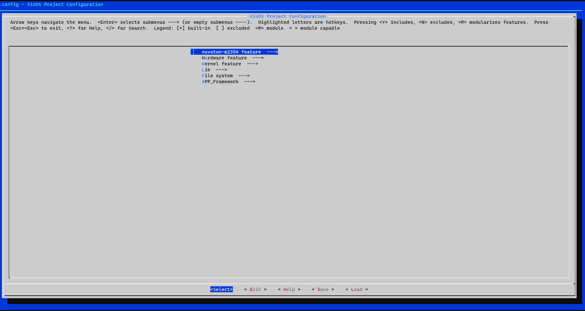
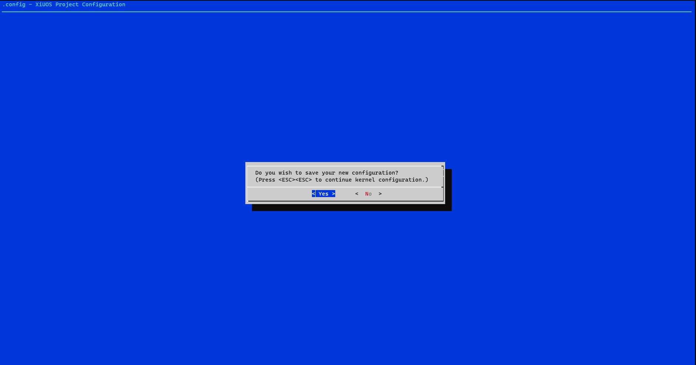
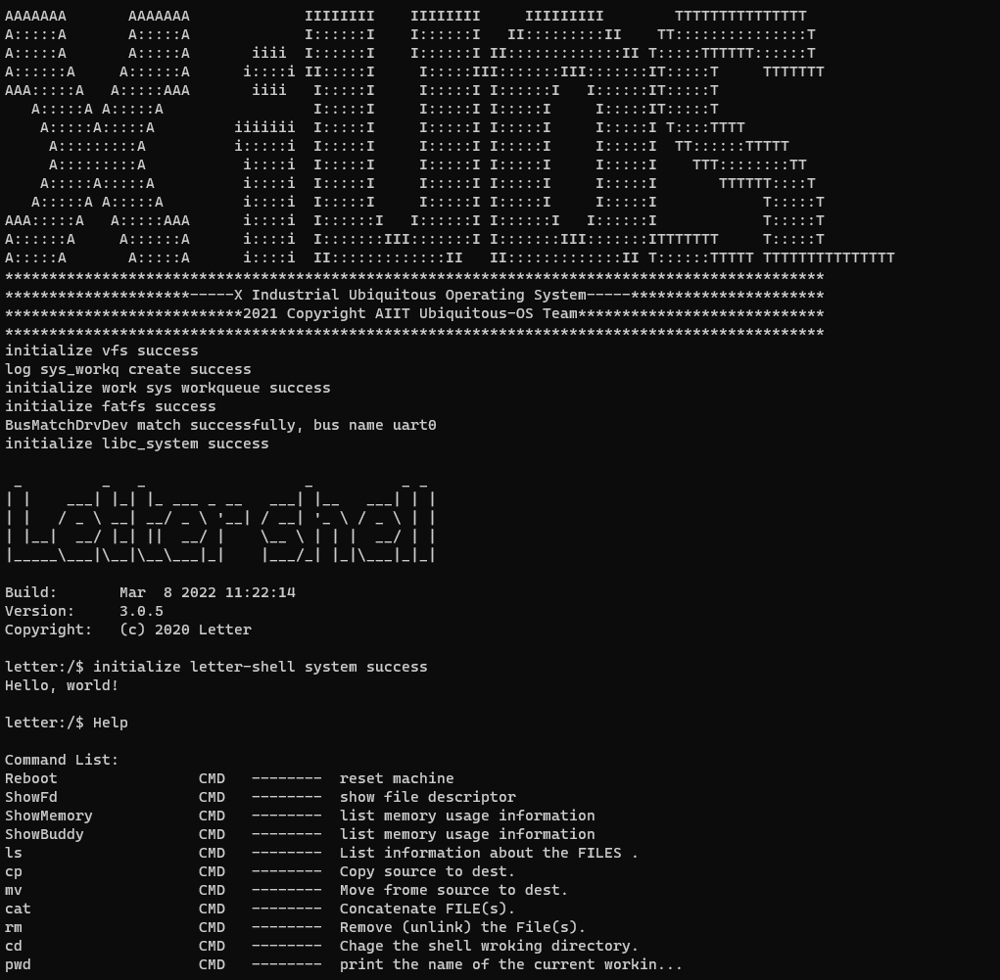

# 从零开始构建矽璓工业物联操作系统：使用ARM架构的nuvoton-m2354

# nuvoton-m2354

[XiUOS](http://xuos.io/) (X Industrial Ubiquitous Operating System) 矽璓XiUOS是一款面向智慧车间的工业物联网操作系统，主要由一个极简的微型实时操作系统内核和其上的工业物联框架构成，通过高效管理工业物联网设备、支撑工业物联应用，在生产车间内实现智能化的“感知环境、联网传输、知悉识别、控制调整”，促进以工业设备和工业控制系统为核心的人、机、物深度互联，帮助提升生产线的数字化和智能化水平。

## 1. 简介

| 硬件 | 描述 |
| -- | -- |
|芯片型号| M2354KJFA |
|架构| cortex-m23 |
|主频| 96MHz |
|片内SRAM| 256KB |
|Flash| 1MB Dual Bank Flash |
|外设支持| UART |

XiUOS板级当前支持使用UART0。

## 2. 开发环境搭建

### 推荐使用：

**操作系统：** ubuntu18.04 [https://ubuntu.com/download/desktop](https://ubuntu.com/download/desktop)

更新`ubuntu 18.04`源的方法:（根据自身情况而定，可以不更改）

第一步:打开sources.list文件

```c
sudo vim /etc/apt/sources.list
```

第二步:将以下内容复制到sources.list文件

```c
deb http://mirrors.aliyun.com/ubuntu/ bionic main restricted universe multiverse
deb http://mirrors.aliyun.com/ubuntu/ bionic-security main restricted universe multiverse
deb http://mirrors.aliyun.com/ubuntu/ bionic-updates main restricted universe multiverse
deb http://mirrors.aliyun.com/ubuntu/ bionic-proposed main restricted universe multiverse
deb http://mirrors.aliyun.com/ubuntu/ bionic-backports main restricted universe multiverse
deb-src http://mirrors.aliyun.com/ubuntu/ bionic main restricted universe multiverse
deb-src http://mirrors.aliyun.com/ubuntu/ bionic-security main restricted universe multiverse
deb-src http://mirrors.aliyun.com/ubuntu/ bionic-updates main restricted universe multiverse
deb-src http://mirrors.aliyun.com/ubuntu/ bionic-proposed main restricted universe multiverse
deb-src http://mirrors.aliyun.com/ubuntu/ bionic-backports main restricted universe multiverse
```

第三步:更新源和系统软件

```c
sudo apt-get update
sudo apt-get upgrade
```

**开发工具推荐使用 VSCode   ，VScode下载地址为：** VSCode  [https://code.visualstudio.com/](https://code.visualstudio.com/)，推荐下载地址为 [http://vscode.cdn.azure.cn/stable/3c4e3df9e89829dce27b7b5c24508306b151f30d/code_1.55.2-1618307277_amd64.deb](http://vscode.cdn.azure.cn/stable/3c4e3df9e89829dce27b7b5c24508306b151f30d/code_1.55.2-1618307277_amd64.deb)

### 依赖包安装：

```
$ sudo apt install build-essential pkg-config  git
$ sudo apt install gcc make libncurses5-dev openssl libssl-dev bison flex libelf-dev autoconf libtool gperf libc6-dev
```

**XiUOS操作系统源码下载：** XiUOS [https://www.gitlink.org.cn/xuos/xiuos](https://www.gitlink.org.cn/xuos/xiuos)

新建一个空文件夹并进入文件夹中，并下载源码，具体命令如下：

```c
mkdir test  &&  cd test
git clone https://gitlink.org.cn/xuos/xiuos.git
```

1、打开XiUOS源码文件包可以看到以下目录：
| 名称 | 说明 |
| -- | -- |
| APP_Framework | 应用代码 |
| Ubiquitous | 板级支持包,支持NuttX、RT-Thread和XiZi内核 |

2、打开XiZi内核源码文件包可以看到以下目录：
| 名称 | 说明 |
| -- | -- |
| arch | 架构代码 |
| board | 板级支持包 |
| fs | 文件系统 |
| kernel | 内核源码 |
| lib | 第三方库源码 |
| resources | 驱动文件 |
| tool | 系统工具 |

使用VScode打开代码，具体操作步骤为：在源码文件夹下打开系统终端，输入`code .`即可打开VScode开发环境，如下图所示：

<div align= "center"> 

  </div>

### 裁减配置工具的下载

裁减配置工具：

**工具地址：** kconfig-frontends [https://www.gitlink.org.cn/xuos/kconfig-frontends](https://www.gitlink.org.cn/xuos/kconfig-frontends)，下载与安装的具体命令如下：

```c
mkdir kfrontends  && cd kfrontends
git clone https://gitlink.org.cn/xuos/kconfig-frontends.git
```

下载源码后按以下步骤执行软件安装：

```c
cd kconfig-frontends
./xs_build.sh
```

### 编译工具链：

ARM： gcc-arm-none-eabi-6-2017-q1-update/bin/arm-none-eabi(`gcc 6.3.1 20170215 (release) [ARM/embedded-6-branch revision 245512]`)，安装到Ubuntu的/opt/arm-none-eabi-，需要在新唐官网下载和安装。

**官网地址：** M2354 [https://www.nuvoton.com.cn/products/microcontrollers/arm-cortex-m23-mcus/m2354-series/?group=Software&tab=2
](https://www.nuvoton.com.cn/products/microcontrollers/arm-cortex-m23-mcus/m2354-series/?group=Software&tab=2
)

## 编译说明

### 编辑环境：`Ubuntu18.04`

### 编译工具链：`arm-none-eabi-gcc`
使用`VScode`打开工程的方法有多种，本文介绍一种快捷键，在项目目录下将`code .`输入linux系统命令终端即可打开目标项目


编译步骤：

1.在VScode命令终端中执行以下命令，生成配置文件

```c
cd ./Ubiquitous/XiZi
make BOARD=nuvoton-m2354 distclean
make BOARD=nuvoton-m2354 menuconfig
```

2.在menuconfig界面配置需要关闭和开启的功能，按回车键进入下级菜单，按Y键选中需要开启的功能，按N键选中需要关闭的功能，配置结束后保存并退出（本例旨在演示简单的输出例程，所以没有需要配置的选项，双击快捷键ESC退出配置）



退出时选择`yes`保存上面所配置的内容，如下图所示：



3.继续执行以下命令，进行编译

```
make BOARD=nuvoton-m2354
```

4.如果编译正确无误，会产生XiZi-nuvoton-m2354.elf、XiZi-nuvoton-m2354.bin文件。

## 3. 烧写及运行

### 3.1 烧写
1、nuvoton-m2354开发板使用片上Nu-Link2-Me v1.0烧写接口，拨码开关1 on 2 on 3 on 4 on，使用Micro USB与电脑连接(需提前安装Nu-Link_USB_Driver驱动)，便可支持虚拟串口功能，linux系统和windows系统均会提示接入新磁盘，将编译生成的bin文件拷贝至虚拟磁盘中，等待设备重启，提示再次接入新磁盘后即可完成烧写下载功能。

### 3.2 运行结果

1、按照3.1烧写步骤执行后，若程序正常，则串口终端上会显示启动信息打印输出。如下图所示：

